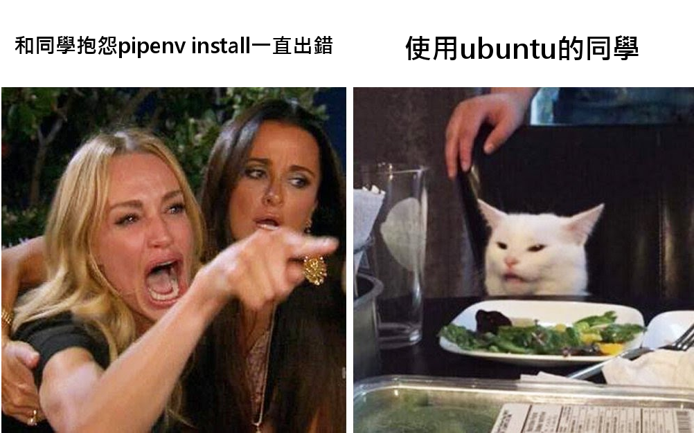

# TOC Project 2020-貓貓梗圖產生器

## 動機
因為有時候想做梗圖的時候，但很懶得調整文字的位置及大小，想說有沒有一個東西能夠懶人的輸入文字，就可以產生不錯的圖片，排版也不會太難看

## 使用技術
* FSM
* line carousel template/ button template
* line 傳送圖片功能
* 爬蟲
* python pillow (用來畫圖)

## 檔案介紹
1. app.py： 主要運行的檔案，定義FSM的transition與在哪個state call哪個trigger function，並處理line傳送過來的資訊
2. fsm.py： FSM中有關 enter/exit state 與 check condition 的function都寫在此檔案中
3. utils.py： linebot model的使用和傳送的function都寫在此檔案中
4. upload.py： 用來畫圖並調整畫在圖片位置的文字，upload至imgur以便傳圖片回line的function都寫在此檔案中
5. crawler.py： 用來爬特定的網址中的圖片，並random回傳圖片的網址

## 功能介紹
### 選擇想要的梗圖加上文字
    1. 在user state中輸入「選擇梗圖」
	2. 跳出選擇梗圖的carousel template，我寫了三個可以自己填字的梗圖選擇
	
	3. 選擇完之後，打上你想要填上的文字，填完就會返回你做好的圖片了
	

### fsm圖呈現
	在user state中輸入「fsm」，就會回傳fsm圖
	![image]https://i.imgur.com/3wzDnGl.png

### 隨機傳梗圖
	在user state中輸入「隨機傳梗圖」，就會利用爬蟲的方法，在此網頁的第1-300頁的梗圖中隨機選擇一張圖片回傳
	![image]https://i.imgur.com/kPe1T0e.png

## FSM圖
![image]https://i.imgur.com/KXkGrza.png

## 遇到困難
在windows安裝python的問題：感覺我處理這個project有一大部分的時間是在處理環境的部分
主要是因為「pipenv install」的部分，pygraphviz的路徑問題一直導致失敗

解決方法：直接使用anaconda管理，需要神麼就套件pip install下載，但要記得管理requirement.txt

## 可改進的部分&願景
1. 填入文字，自動調整合適大小的演算法
2. 增加多一點可選擇的圖片
3. 能讓多人同時使用
4. 在隨機傳梗圖中，讓user自己上傳梗圖
